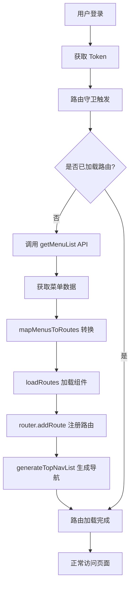

# 动态路由与组件注册机制

本文档详细介绍 Vue Admin JS 项目中的动态路由系统、组件自动注册和路由动态注册的实现原理。

---

## 📋 目录

- [概述](#概述)
- [动态路由流程](#动态路由流程)
- [组件自动注册](#组件自动注册)
- [路由动态注册](#路由动态注册)
- [菜单数据结构](#菜单数据结构)
- [动态导航生成](#动态导航生成)
- [最佳实践](#最佳实践)

---

## 概述

### 核心特性

- ✅ **基于权限的动态路由**: 根据用户权限动态生成路由
- ✅ **组件自动扫描**: 使用 Vite 的 `import.meta.glob` 自动扫描组件
- ✅ **零配置路由映射**: 通过命名约定自动映射组件到路由
- ✅ **动态顶部导航**: 根据菜单数据自动生成顶部导航
- ✅ **多级路由支持**: 支持任意层级的嵌套路由

### 技术栈

- **Vue Router 3.6.5**: 路由管理
- **Vite 5.4.21**: 构建工具,提供 `import.meta.glob` API
- **Vuex 3.6.2**: 状态管理,存储菜单和导航数据

---

## 动态路由流程

### 1. 整体流程图



### 2. 核心代码位置

| 文件                             | 功能                       |
| -------------------------------- | -------------------------- |
| `src/router/origin/index.js`     | 路由守卫和动态路由加载逻辑 |
| `src/router/origin/asyncFile.js` | 组件自动扫描和映射         |
| `src/store/index.js`             | 菜单数据存储和导航生成     |
| `src/api/origin/index.js`        | 菜单数据获取 API           |

### 3. 路由守卫实现

```javascript
// src/router/origin/index.js
router.beforeEach(async (to, from, next) => {
  NProgress.start()

  const token = getToken()

  if (token) {
    if (to.path === '/login') {
      next({ path: '/' })
    } else {
      if (!isRoutesLoaded) {
        try {
          // 加载动态路由
          await handleDynamicRoutes()
          isRoutesLoaded = true
          // 使用 replace 避免 history 混乱
          next({ ...to, replace: true })
        } catch (error) {
          console.error('Dynamic routes load failed', error)
          next({ path: '/login' })
        }
      } else {
        next()
      }
    }
  } else {
    // 白名单路由直接放行
    if (whiteRoutes.includes(to.name) || whiteRoutes.includes(to.path)) {
      next()
    } else {
      next({ path: '/login' })
    }
  }
})
```

---

## 组件自动注册

### 1. Vite Glob 导入

使用 Vite 的 `import.meta.glob` API 自动扫描 `src/views` 目录下的所有 Vue 组件:

```javascript
// src/router/origin/asyncFile.js
const modules = import.meta.glob(['../../views/**/*.vue', '!../../views/**/components/**'])

// 结果示例:
// {
//   '../../views/common/ViewLogin.vue': () => import('...'),
//   '../../views/overview/ViewDashboard.vue': () => import('...'),
//   '../../views/system/users/ViewUserManagement.vue': () => import('...'),
//   ...
// }
```

**特点:**

- ✅ 自动扫描所有 `.vue` 文件
- ✅ 排除 `components` 子目录(避免扫描组件)
- ✅ 返回懒加载函数,支持代码分割

### 2. 组件映射逻辑

```javascript
export function loadRoutes(componentName) {
  // 1. 检查手动映射 (Layout 等特殊组件)
  if (componentMap[componentName]) {
    return componentMap[componentName]
  }

  // 2. 自动搜索 views 目录下的组件
  const modulePath = Object.keys(modules).find((path) => {
    const fileName = path.split('/').pop().replace('.vue', '').toLowerCase()
    const targetName = componentName.toLowerCase()
    const pureTargetName = targetName.replace('view', '')

    return (
      fileName === targetName ||
      fileName === pureTargetName ||
      path.toLowerCase().includes(`/${targetName}.vue`)
    )
  })

  if (modulePath) {
    return modules[modulePath]
  }

  // 3. 降级到 404
  console.error(`找不到组件映射 "${componentName}"`)
  return () => import('@/views/common/View404.vue')
}
```

**匹配规则:**

1. **精确匹配**: `ViewDashboard` → `ViewDashboard.vue`
2. **忽略 View 前缀**: `ViewDashboard` → `Dashboard.vue`
3. **路径包含**: `ViewUserManagement` → `system/users/ViewUserManagement.vue`

### 3. 命名约定

| 菜单 permissionValue | 组件文件路径                                 | 说明     |
| -------------------- | -------------------------------------------- | -------- |
| `ViewDashboard`      | `views/overview/ViewDashboard.vue`           | 精确匹配 |
| `ViewUserManagement` | `views/system/users/ViewUserManagement.vue`  | 路径匹配 |
| `ViewLogin`          | `views/common/ViewLogin.vue`                 | 精确匹配 |
| `ParentView`         | 虚拟组件 `{ render: h => h('router-view') }` | 中间节点 |

**最佳实践:**

- ✅ 页面组件使用 `View` 前缀
- ✅ `permissionValue` 与组件名保持一致
- ✅ 中间节点使用 `ParentView`

---

## 路由动态注册

### 1. 菜单转路由

```javascript
// src/router/origin/index.js
const mapMenusToRoutes = (menuList, isRoot = false, parentMeta = {}) => {
  return menuList.map((item) => {
    const hasChildren = item.subMenu && item.subMenu.length > 0

    // 确定导航上下文
    const topNav = item.topNav ?? parentMeta.topNav ?? 0
    const aside = item.aside ?? parentMeta.aside ?? 1

    const route = {
      path: item.uri,
      name: item.permissionValue === 'ParentView' ? undefined : item.permissionValue,
      component: (() => {
        // 根节点且有子菜单 → Layout
        if (isRoot && hasChildren) return loadRoutes('Layout')

        // 中间节点且有子菜单 → 虚拟组件
        if (hasChildren && (!item.permissionValue || item.permissionValue === 'ParentView')) {
          return { render: (h) => h('router-view') }
        }

        // 叶子节点 → 实际组件
        return loadRoutes(item.permissionValue || item.name)
      })(),
      meta: {
        title: item.name,
        icon: item.icon,
        aside,
        topNav,
        noCache: item.noCache || false,
      },
      children: hasChildren ? mapMenusToRoutes(item.subMenu, false, { topNav, aside }) : [],
    }

    // 根节点无子菜单 → 包裹 Layout
    if (isRoot && !hasChildren && route.path.startsWith('/')) {
      const originalComponent = route.component
      const originalName = route.name
      route.component = loadRoutes('Layout')
      route.name = undefined
      route.children = [
        {
          path: '',
          name: originalName,
          component: originalComponent,
          meta: { ...route.meta },
        },
      ]
    }

    return route
  })
}
```

### 2. 路由注册

```javascript
async function handleDynamicRoutes() {
  // 1. 获取菜单数据
  const res = await getMenuList()
  const menus = res.data || []

  // 2. 转换为路由配置
  const dynamicRoutes = mapMenusToRoutes(menus, true)

  // 3. 添加 404 路由 (必须在最后)
  dynamicRoutes.push({
    path: '*',
    redirect: '/404',
    meta: { aside: 0 },
  })

  // 4. 注册路由
  dynamicRoutes.forEach((route) => {
    router.addRoute(route)
  })

  // 5. 存储菜单数据
  if (store.commit) {
    store.commit('app/SET_MENU_LIST', menus)
    // 生成动态导航
    store.dispatch('app/generateTopNavList', menus)
  }

  return dynamicRoutes
}
```

### 3. 路由结构示例

**输入菜单数据:**

```json
{
  "id": 9,
  "name": "systemManagement",
  "uri": "/system",
  "icon": "gears",
  "permissionValue": "ParentView",
  "topNav": 5,
  "subMenu": [
    {
      "id": 93,
      "name": "userManagement",
      "uri": "users",
      "permissionValue": "ViewUserManagement",
      "topNav": 5
    }
  ]
}
```

**生成路由配置:**

```javascript
{
  path: '/system',
  component: Layout,
  meta: { title: 'systemManagement', icon: 'gears', topNav: 5 },
  children: [
    {
      path: 'users',
      name: 'ViewUserManagement',
      component: () => import('@/views/system/users/ViewUserManagement.vue'),
      meta: { title: 'userManagement', topNav: 5 }
    }
  ]
}
```

---

## 菜单数据结构

### 1. 菜单字段说明

| 字段              | 类型   | 必填 | 说明                            |
| ----------------- | ------ | ---- | ------------------------------- |
| `id`              | Number | ✅   | 菜单唯一标识                    |
| `name`            | String | ✅   | 菜单名称 (i18n key)             |
| `uri`             | String | ✅   | 路由路径                        |
| `icon`            | String | ❌   | 图标名称 (FontAwesome)          |
| `permissionValue` | String | ✅   | 权限标识/组件名                 |
| `type`            | Number | ✅   | 菜单类型 (1=菜单)               |
| `show`            | Number | ✅   | 是否显示 (1=显示, 0=隐藏)       |
| `aside`           | Number | ✅   | 是否显示侧边栏 (1=显示, 0=隐藏) |
| `topNav`          | Number | ✅   | 所属顶部导航 (0-5)              |
| `subMenu`         | Array  | ❌   | 子菜单列表                      |

### 2. 菜单层级示例

```javascript
// 一级菜单 (无子菜单)
{
  id: 1,
  name: 'dashboard',
  uri: '/dashboard',
  icon: 'house',
  permissionValue: 'ViewDashboard',
  topNav: 0,
  aside: 0
}

// 二级菜单 (有子菜单)
{
  id: 6,
  name: 'vpnService',
  uri: '/vpn',
  icon: 'shield-virus',
  permissionValue: 'ParentView',
  topNav: 2,
  subMenu: [
    {
      id: 61,
      name: 'userList',
      uri: 'users',
      permissionValue: 'ViewUserList',
      topNav: 2
    }
  ]
}

// 三级菜单 (嵌套子菜单)
{
  id: 5,
  name: 'securityPolicy',
  uri: '/network/security',
  permissionValue: 'ParentView',
  topNav: 1,
  subMenu: [
    {
      id: 51,
      name: 'firewall',
      uri: 'firewall',
      permissionValue: 'ParentView',
      topNav: 1,
      subMenu: [
        {
          id: 511,
          name: 'firewallSettings',
          uri: 'settings',
          permissionValue: 'ViewFirewallSettings',
          topNav: 1
        }
      ]
    }
  ]
}
```

---

## 动态导航生成

### 1. 导航配置

```javascript
// src/store/index.js
actions: {
  generateTopNavList({ commit }, menuList) {
    // 定义顶部导航的基础配置
    const topNavConfig = [
      { key: 0, labelKey: 'menu.topNav.overview', uri: '/dashboard', icon: 'house' },
      { key: 1, labelKey: 'menu.topNav.network', uri: '/network/overview', icon: 'network-wired' },
      { key: 2, labelKey: 'menu.topNav.vpn', uri: '/vpn/users', icon: 'shield-halved' },
      { key: 3, labelKey: 'menu.topNav.edge', uri: '/edge/node', icon: 'microchip' },
      { key: 4, labelKey: 'menu.topNav.wizard', uri: '/wizard/quick', icon: 'wand-magic-sparkles' },
      { key: 5, labelKey: 'menu.topNav.system', uri: '/system/logs', icon: 'gears' },
    ]

    // 统计每个 topNav 下有多少菜单项
    const topNavCounts = {}
    menuList.forEach((menu) => {
      const topNav = menu.topNav
      if (topNav !== undefined && topNav !== null) {
        topNavCounts[topNav] = (topNavCounts[topNav] || 0) + 1
      }
    })

    // 只保留有菜单项的顶部导航
    const filteredTopNavList = topNavConfig.filter((nav) => {
      return topNavCounts[nav.key] > 0
    })

    commit('SET_TOP_NAV_LIST', filteredTopNavList)
  },
}
```

### 2. 导航渲染

```vue
<!-- src/layout/components/LayoutNavbar.vue -->
<button v-for="nav in topNavList" :key="nav.key" @click="handleTopNavClick(nav)">
  <CompIcon :name="nav.icon" :size="18" />
  <span>{{ $t(nav.labelKey) }}</span>
</button>
```

### 3. 权限控制示例

**超级管理员** (`admin`):

- 返回所有菜单 → 显示所有导航 (0-5)

**网络管理员** (`network_admin`):

- 返回 topNav 为 0, 1, 2 的菜单 → 只显示概览、网络、VPN

**普通用户** (`user`):

- 返回 topNav 为 0 的菜单 → 只显示概览

---

## 最佳实践

### 1. 组件命名规范

✅ **推荐:**

```
views/
├── overview/
│   └── ViewDashboard.vue          # permissionValue: ViewDashboard
├── system/
│   ├── users/
│   │   └── ViewUserManagement.vue # permissionValue: ViewUserManagement
│   └── roles/
│       └── ViewRoleManagement.vue # permissionValue: ViewRoleManagement
```

❌ **不推荐:**

```
views/
├── Dashboard.vue                   # 缺少 View 前缀
├── UserMgmt.vue                    # 名称不一致
└── system/
    └── role-management.vue         # 使用短横线命名
```

### 2. 菜单数据设计

✅ **推荐:**

```javascript
{
  id: 93,
  name: 'userManagement',           // i18n key
  uri: 'users',                      // 简洁的路径
  permissionValue: 'ViewUserManagement', // 与组件名一致
  topNav: 5,                         // 明确的导航归属
  aside: 1                           // 明确是否显示侧边栏
}
```

❌ **不推荐:**

```javascript
{
  id: 93,
  name: '用户管理',                  // 硬编码中文
  uri: '/system/user-management',    // 绝对路径(应该是相对路径)
  permissionValue: 'UserMgmt',       // 与组件名不一致
  // 缺少 topNav 和 aside
}
```

### 3. 路由层级设计

**一级路由** (无子菜单):

```javascript
{
  uri: '/dashboard',
  permissionValue: 'ViewDashboard',
  topNav: 0,
  aside: 0  // 不显示侧边栏
}
```

**二级路由** (有子菜单):

```javascript
{
  uri: '/system',
  permissionValue: 'ParentView',  // 中间节点
  topNav: 5,
  aside: 1,  // 显示侧边栏
  subMenu: [
    {
      uri: 'users',  // 相对路径
      permissionValue: 'ViewUserManagement',
      topNav: 5
    }
  ]
}
```

### 4. 权限控制

```javascript
// src/api/origin/index.js
function getMenuByUser(username) {
  const allMenus = menuMock.data

  const userPermissions = {
    admin: allMenus,
    network_admin: allMenus.filter((m) => [0, 1, 2].includes(m.topNav)),
    system_admin: allMenus.filter((m) => [0, 5].includes(m.topNav)),
    user: allMenus.filter((m) => m.topNav === 0),
  }

  return {
    code: 200,
    data: userPermissions[username] || userPermissions.user,
    message: 'success',
  }
}
```

---

## 常见问题

### Q1: 组件找不到怎么办?

**错误信息:**

```
[Router Error]: 找不到组件映射 "ViewUserManagement"
```

**解决方法:**

1. 检查组件文件是否存在: `src/views/system/users/ViewUserManagement.vue`
2. 检查组件名称是否正确 (大小写敏感)
3. 检查 `permissionValue` 是否与组件名一致
4. 确保组件不在 `components` 子目录中

### Q2: 路由嵌套层级不对?

**问题:** 三级菜单显示为二级

**解决方法:**

1. 检查 `subMenu` 是否正确嵌套
2. 确保中间节点使用 `permissionValue: 'ParentView'`
3. 检查 `uri` 是否使用相对路径 (不要以 `/` 开头)

### Q3: 顶部导航不显示?

**问题:** 某个导航项不显示

**解决方法:**

1. 检查是否有菜单的 `topNav` 对应该导航项
2. 确认 `generateTopNavList` 是否被调用
3. 检查菜单数据是否正确返回

### Q4: 404 路由被提前匹配?

**问题:** 所有路由都跳转到 404

**解决方法:**

1. 确保 404 路由在最后添加
2. 检查动态路由是否正确注册
3. 使用 `router.getRoutes()` 查看已注册的路由

---

## 调试技巧

### 1. 查看已注册路由

```javascript
// 在浏览器控制台执行
console.log(router.getRoutes())
```

### 2. 查看菜单数据

```javascript
// 在浏览器控制台执行
console.log(store.state.app.menuList)
console.log(store.state.app.topNavList)
```

### 3. 查看组件映射

```javascript
// 在 asyncFile.js 中添加
console.log('Available modules:', Object.keys(modules))
```

### 4. 路由守卫日志

```javascript
// 在 router/origin/index.js 中添加
router.beforeEach(async (to, from, next) => {
  console.log('Route guard:', { to: to.path, from: from.path, isRoutesLoaded })
  // ...
})
```

---

## 总结

Vue Admin JS 的动态路由系统通过以下机制实现了灵活的权限控制:

1. **组件自动扫描**: 使用 `import.meta.glob` 自动发现组件
2. **零配置映射**: 通过命名约定自动映射组件到路由
3. **菜单驱动**: 后端返回菜单数据,前端动态生成路由
4. **动态导航**: 根据权限自动显示/隐藏导航项
5. **懒加载**: 所有页面组件按需加载,优化性能

这套机制使得添加新页面变得非常简单:

1. 创建 Vue 组件 (遵循命名约定)
2. 后端返回对应的菜单数据
3. 系统自动完成路由注册和导航生成

无需手动配置路由,大大提高了开发效率! 🚀
