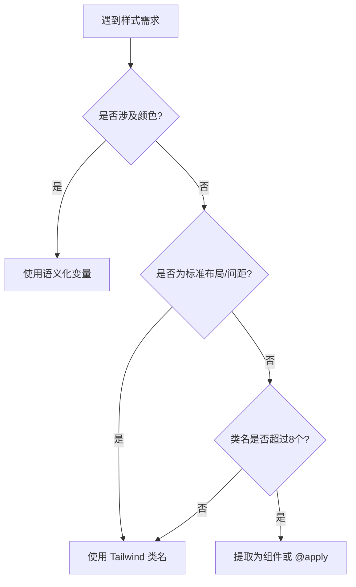

# Vue 3 + Tailwind CSS v4 开发规范

> **适用项目:** 使用 Options API + Tailwind v4 + 设计系统的中大型项目  
> **目标:** 平衡开发速度与设计一致性,减少硬编码,提升可维护性

---

## 1. 样式使用准则 (Decision Matrix)

### 优先级规则



---

### A. 优先使用 Tailwind 标准类名

**适用场景:**

- 布局 (Flex/Grid)
- 内边距/外边距 (Padding/Margin)
- 标准字号、圆角
- 显示/隐藏、响应式

**规则:**

- ✅ 设计稿数值能对齐 Tailwind 默认步长 (4px) 时,**必须**使用标准类
- ✅ 优先使用语义化档位 (sm/md/lg) 而非具体数值

**示例:**

```vue
<!-- ✅ 正确 -->
<div class="flex items-center gap-4 p-6 rounded-lg">
  
  <div class="flex-1">
    <h3 class="text-lg font-bold">标题</h3>
    <p class="text-sm">描述</p>
  </div>
</div>

<!-- ❌ 错误 -->
<div style="display: flex; align-items: center; gap: 16px; padding: 24px;">
  ...
</div>
```

---

### B. 强制使用语义化自定义变量 (Design Tokens)

**适用场景:**

- 项目品牌色
- 背景色、文字色
- 特殊边框色、阴影

**规则:**

- ❌ **禁止**使用任意值语法 `text-[#1447E6]`
- ✅ **必须**在 `@theme` 中定义语义化名称
- ✅ 变量名需与设计稿 (蓝湖/Figma) **1:1 对应**

**示例:**

```css
/* ✅ 正确: 在 theme.css 中定义 */
@theme {
  --color-brand: var(--colors-brand-600, #1447e6);
  --color-bg-primary: var(--colors-bg-neutral-primary, #ffffff);
  --shadow-card: 0 4px 6px -1px rgb(0 0 0 / 0.1);
}
```

```vue
<!-- ✅ 正确: 使用语义化名称 -->
<template>
  <div class="custom-card">内容</div>
</template>

<style scoped>
.custom-card {
  background-color: var(--color-bg-primary);
  color: var(--color-text-body);
  box-shadow: var(--shadow-card);
}
</style>

<!-- ❌ 错误: 硬编码 -->
<div class="bg-[#ffffff] text-[#333333] shadow-[0_4px_6px_rgba(0,0,0,0.1)]">
  内容
</div>
```

---

### C. 使用自定义样式 (Scoped CSS)

**适用场景:**

1. **颜色定义** - 所有颜色必须用 CSS 变量
2. **复杂交互** - 伪元素、动画、特殊状态
3. **第三方库覆盖**

**规则:**

- ❌ **不推荐使用 `@apply`** - 会增加 CSS 体积,降低可读性
- ✅ **Tailwind 类直接写在 template** - 间距、布局、字体等
- ✅ **颜色用 CSS 变量** - 在 `<style scoped>` 中定义

**推荐写法:**

```vue
<!-- ✅ 推荐:类名在 template,颜色在 style -->
<template>
  <div class="card-container rounded-lg border shadow-sm p-6">
    <h3 class="card-title text-lg font-semibold mb-4">{{ title }}</h3>
    <slot></slot>
  </div>
</template>

<style scoped>
.card-container {
  background-color: var(--color-bg-primary);
  border-color: var(--color-border);
}

.card-title {
  color: var(--color-text-heading);
}
</style>
```

**不推荐写法:**

```vue
<!-- ❌ 不推荐:使用 @apply -->
<template>
  <div class="card-container">
    <h3 class="card-title">{{ title }}</h3>
  </div>
</template>

<style scoped>
.card-container {
  @apply rounded-lg border shadow-sm p-6;
  background-color: var(--color-bg-primary);
}

.card-title {
  @apply text-lg font-semibold mb-4;
  color: var(--color-text-heading);
}
</style>
```

**原因:**

- ❌ `@apply` 会将类名编译成重复的 CSS,增加体积
- ❌ 降低可读性,需要在两个地方查看样式
- ✅ 直接写类名更直观,便于维护

---

## 2. 详细分类建议表

| 类别       | 使用方式    | 规范要求                                         | 示例                      |
| :--------- | :---------- | :----------------------------------------------- | :------------------------ |
| **颜色**   | 自定义变量  | 必须在 `@theme` 定义,名称对齐设计稿              | `var(--color-brand)`      |
| **间距**   | Tailwind 类 | 优先匹配默认步长,非标间距在配置中定义            | `p-4`, `gap-3.5`          |
| **圆角**   | 自定义变量  | 统一命名 `rounded-base/lg`,禁止 `rounded-[12px]` | `var(--radius-base)`      |
| **宽高**   | Tailwind 类 | 容器用标准类,特定元素封装进组件                  | `w-full`, `h-screen`      |
| **阴影**   | 自定义变量  | 复杂阴影定义为语义化名称                         | `var(--shadow-card)`      |
| **字体**   | Tailwind 类 | 使用标准档位                                     | `text-sm`, `font-bold`    |
| **布局**   | Tailwind 类 | Flex/Grid 必须用类名                             | `flex`, `grid-cols-3`     |
| **响应式** | Tailwind 类 | 使用断点前缀                                     | `md:flex-row`, `lg:gap-6` |

---

## 3. 补充开发规则 (Best Practices)

### 规则一:变量命名"所见即所得"

**原则:** 代码中的变量名必须与蓝湖/Figma 的名称 **1:1 对应**

```css
/* ❌ 坏实践: 名称太笼统 */
--color-main: #1447e6;
--bg-light: #f5f5f5;

/* ✅ 好实践: 与设计稿对应 */
--color-brand: #1447e6;
--color-bg-primary: #ffffff;
--color-bg-secondary: #f5f5f5;
```

**命名规范:**

- 品牌色: `--color-brand`, `--color-brand-light`
- 背景色: `--color-bg-{primary|secondary|tertiary}`
- 文字色: `--color-text-{heading|body|subtle}`
- 状态色: `--color-{success|warning|danger}`

---

### 规则二:利用 CSS Fallback 激活 IDE 预览

**问题:** Tailwind v4 的 CSS 变量在 IDE 中不显示色块预览

**解决方案:** 在 `@theme` 中强制使用回退值

```css
/* ✅ 推荐: 带回退值 */
@theme {
  --color-brand: var(--colors-brand-600, #1447e6);
  --color-bg-primary: var(--colors-bg-neutral, #ffffff);
}

/* ❌ 不推荐: 无回退值 */
@theme {
  --color-brand: var(--colors-brand-600);
}
```

**优势:**

- ✅ IDE 显示色块预览
- ✅ 保持多主题动态切换能力
- ✅ 降低调试难度

---

### 规则三:禁止"像素完美"的过度追求

**原则:** 设计稿的非标数值应自动归位到最接近的 Tailwind 档位

**对照表:**

| 设计稿值 | 归位到 | Tailwind 类 | 说明           |
| :------- | :----- | :---------- | :------------- |
| 15px     | 16px   | `p-4`       | 4 \* 4px       |
| 14px     | 14px   | `p-3.5`     | 需在配置中定义 |
| 22px     | 20px   | `p-5`       | 5 \* 4px       |
| 18px     | 16px   | `p-4`       | 优先标准档位   |

**配置示例:**

```javascript
// vite.config.js (Tailwind v4 不需要配置文件)
// 如需非标间距,在 CSS 中定义:
@theme {
  --spacing-3\.5: 14px;
  --spacing-4\.5: 18px;
}
```

**规则:**

- 误差 ≤2px: 归位到标准档位
- 误差 >2px 且高频使用: 在配置中定义
- 仅出现一次: 使用自定义 CSS

---

### 规则四:组件封装重于类名堆砌

**原则:** 类名超过 **8 个**,考虑重构

**重构方案:**

#### 方案一:提取为独立组件

```vue
<!-- ✅ 推荐:提取为组件 -->
<template>
  <CompCard title="用户信息">
    <p>内容</p>
  </CompCard>
</template>
```

#### 方案二:使用自定义类 + CSS 变量

```vue
<!-- ✅ 推荐:类名在 template,颜色在 style -->
<template>
  <div class="card-container rounded-lg border shadow-sm p-6">
    <h3 class="card-title text-lg font-semibold mb-4">{{ title }}</h3>
    <slot></slot>
  </div>
</template>

<style scoped>
.card-container {
  background-color: var(--color-bg-primary);
  border-color: var(--color-border);
}

.card-title {
  color: var(--color-text-heading);
}
</style>
```

**❌ 不推荐:使用 @apply**

```vue
<!-- ❌ 不推荐 -->
<style scoped>
.card-container {
  @apply rounded-lg border shadow-sm p-6;
}
</style>
```

---

## 4. 新增规则 (Enhanced)

### 规则五:响应式设计优先移动端

**原则:** 默认样式为移动端,使用断点向上扩展

```vue
<!-- ✅ 正确: Mobile First -->
<div class="flex-col md:flex-row gap-2 md:gap-4 p-4 md:p-6">
  ...
</div>

<!-- ❌ 错误: Desktop First -->
<div class="flex-row md:flex-col gap-4 md:gap-2 p-6 md:p-4">
  ...
</div>
```

**断点使用规范:**

| 断点  | 最小宽度 | 使用场景   |
| :---- | :------- | :--------- |
| `sm:` | 640px    | 小屏平板   |
| `md:` | 768px    | 平板横屏   |
| `lg:` | 1024px   | 笔记本     |
| `xl:` | 1280px   | 桌面显示器 |

---

### 规则六:暗黑模式适配策略

**原则:** 优先使用语义化变量,避免手动写 `dark:` 前缀

```vue
<!-- ✅ 推荐: 使用语义化变量 (自动适配) -->
<template>
  <div class="custom-card">内容</div>
</template>

<style scoped>
.custom-card {
  background-color: var(--color-bg-primary);
  color: var(--color-text-body);
}
</style>

<!-- ⚠️ 次选: 手动写 dark: 前缀 -->
<div class="bg-white dark:bg-gray-900 text-gray-900 dark:text-white">
  内容
</div>
```

**暗黑模式变量定义:**

```css
/* 在 theme.css 中定义 */
:root {
  --color-bg-primary: #ffffff;
  --color-text-body: #333333;
}

:root.dark {
  --color-bg-primary: #1a1a1a;
  --color-text-body: #e5e5e5;
}
```

---

### 规则八:注释规范

**原则:** 复杂样式必须注释,说明设计意图

```css
.custom-card {
  /* 主背景色 - 自动适配暗黑模式 */
  background-color: var(--color-bg-primary);

  /* 卡片阴影 - 对应设计稿 "Card/Default" */
  box-shadow: var(--shadow-card);

  /* 特殊处理: 修复 Safari 圆角裁剪 bug */
  transform: translateZ(0);
}
```

---

## 5. 代码审查清单 (Code Review Checklist)

### 提交前自查

- [ ] 是否存在硬编码颜色? (如 `bg-[#ffffff]`)
- [ ] 是否存在非标间距未归位? (如 `p-[15px]`)
- [ ] 类名是否超过 8 个未重构?
- [ ] 是否使用了语义化变量名?
- [ ] 响应式是否遵循 Mobile First?
- [ ] 暗黑模式是否正确适配?
- [ ] 复杂样式是否添加注释?

### 审查者检查点

- [ ] 变量命名是否与设计稿一致?
- [ ] 是否存在重复的样式定义?
- [ ] 组件封装是否合理?
- [ ] 性能是否有优化空间?

---

## 6. 工具与插件推荐

### VSCode 插件

| 插件名称                  | 用途         | 必装?   |
| :------------------------ | :----------- | :------ |
| Tailwind CSS IntelliSense | 类名自动补全 | ✅ 是   |
| PostCSS Language Support  | CSS 变量高亮 | ✅ 是   |
| CSS Variable Autocomplete | 变量自动补全 | ⚠️ 推荐 |
| Prettier                  | 代码格式化   | ✅ 是   |

### 配置示例

```json
// .vscode/settings.json
{
  "tailwindCSS.experimental.classRegex": [["class:\\s*['\"`]([^'\"`]*)['\"`]", "([^'\"`]*)"]],
  "css.customData": [".vscode/css-custom-data.json"]
}
```

---

## 7. 常见问题 (FAQ)

### Q1: 设计稿的颜色与 Tailwind 默认色板不匹配怎么办?

**A:** 在 `@theme` 中定义自定义颜色,使用语义化名称。

```css
@theme {
  --color-brand: #1447e6; /* 项目品牌色 */
  --color-accent: #ff6b6b; /* 强调色 */
}
```

### Q2: 什么时候应该提取组件?

**A:** 满足以下任一条件:

- 类名超过 8 个
- 样式在 3 个以上地方复用
- 包含复杂交互逻辑

### Q3: 如何处理设计稿中的渐变色?

**A:** 定义为 CSS 变量,在组件中使用。

```css
:root {
  --gradient-brand: linear-gradient(135deg, #667eea 0%, #764ba2 100%);
}
```

```vue
<style scoped>
.hero-bg {
  background: var(--gradient-brand);
}
</style>
```

---

## 8. 总结

**核心原则:**

1. **Tailwind 类名** → 布局、间距、响应式
2. **CSS 变量** → 颜色、阴影、品牌相关
3. **自定义 CSS** → 复杂交互、高频复用

**记忆口诀:**

```
布局间距用 Tailwind,
颜色主题用变量,
复用封装成组件,
代码简洁易维护!
```

**最终目标:**

- 代码可读性 ↑
- 维护成本 ↓
- 设计一致性 ↑
- 开发效率 ↑
