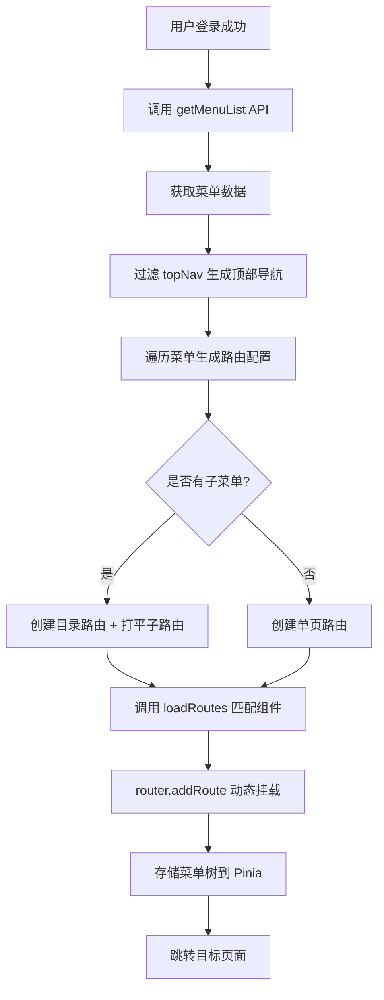

# 路由系统文档

## 1. 路由架构概览

项目采用 **动态路由 + 自动加载** 的架构:

```
src/router/
├── index.js        # 路由实例创建
├── constants.js    # 静态路由 + 顶部导航配置
├── guard.js        # 路由守卫
├── loader.js       # 自动路由加载器
└── generator.js    # 动态路由生成器
```

---

## 2. 自动路由挂载机制

### 2.1 核心原理

使用 **Vite 的 `import.meta.glob`** 自动扫描 `src/views/` 目录:

```javascript
// src/router/loader.js
const views = import.meta.glob([
  "../views/**/*.vue",
  "!../views/**/components/**",
]);
```

**扫描规则:**

- ✅ 包含: `src/views/` 下所有 `.vue` 文件
- ❌ 排除: `src/views/**/components/` 目录(组件文件夹)

---

### 2.2 自动匹配逻辑

```javascript
export function loadRoutes(name) {
  // 1. 特殊组件映射
  if (name === "Layout") {
    return () => import("@/layout/index.vue");
  }
  if (name === "NotFound") {
    return () => import("@/views/common/View404.vue");
  }

  // 2. 自动匹配 View{name}.vue 或 {name}.vue
  const matchKey = Object.keys(views).find((path) => {
    const fileName = path.split("/").pop();
    return fileName === `View${name}.vue` || fileName === `${name}.vue`;
  });

  if (matchKey) {
    return views[matchKey];
  }

  // 3. 兜底:返回空的 RouterView
  return { render: () => h(RouterView) };
}
```

**匹配示例:**

| 权限标识 (permissionValue) | 匹配文件                 | 路径                                      |
| :------------------------- | :----------------------- | :---------------------------------------- |
| `Dashboard`                | `ViewDashboard.vue`      | `src/views/overview/ViewDashboard.vue`    |
| `FormDemo`                 | `ViewFormDemo.vue`       | `src/views/system/ViewFormDemo.vue`       |
| `UserManagement`           | `ViewUserManagement.vue` | `src/views/system/ViewUserManagement.vue` |

---

## 3. 动态路由生成

### 3.1 菜单数据结构

后端返回的菜单数据格式:

```javascript
{
  "id": 1,
  "name": "dashboard",           // i18n key 后缀
  "uri": "/dashboard",           // 路由路径
  "icon": "house",               // 图标名称
  "permissionValue": "Dashboard", // 权限标识(用于匹配组件)
  "topNav": 0,                   // 顶部导航索引
  "aside": 1,                    // 是否显示在侧边栏
  "show": 1,                     // 是否显示
  "type": "1",                   // 类型: 1=菜单, 2=目录, 3=按钮
  "alwaysShow": 0,               // 是否总是显示
  "subMenu": []                  // 子菜单
}
```

---

### 3.2 路由生成流程



---

### 3.3 代码实现

```javascript
// src/router/generator.js
export async function handleLoginMenus(next, to, router) {
  const menuStore = useMenuStore();

  // 1. 获取菜单数据
  const res = await getMenuList();
  let menuList = res.data || [];

  // 2. 生成顶部导航
  const topNavList = topNavConfig.filter((nav) => {
    return menuList.some((m) => m.topNav === nav.key);
  });
  menuStore.setTopNavList(topNavList);

  // 3. 转换为路由配置
  const addRoutesArr = [];
  menuList.forEach((menu) => {
    if (menu.subMenu && menu.subMenu.length > 0) {
      // 有子菜单:创建目录路由
      addRoutesArr.push({
        path: menu.uri,
        component: loadRoutes("Layout"),
        meta: { titleKey: `nav.${menu.name}`, icon: menu.icon },
        children: getFlatRoutes(menu.subMenu), // 打平子路由
      });
    } else {
      // 无子菜单:创建单页路由
      addRoutesArr.push({
        path: menu.uri,
        component: loadRoutes("Layout"),
        children: [
          {
            path: "",
            name: menu.permissionValue,
            component: loadRoutes(menu.permissionValue),
            meta: { titleKey: `nav.${menu.name}` },
          },
        ],
      });
    }
  });

  // 4. 动态挂载路由
  addRoutesArr.forEach((route) => router.addRoute(route));

  // 5. 存储菜单树
  menuStore.setMenuList(getMenuTree(menuList));

  // 6. 跳转
  next({ ...to, replace: true });
}
```

---

## 4. 路由守卫

### 4.1 全局前置守卫

```javascript
// src/router/guard.js
export function setupGuards(router) {
  router.beforeEach(async (to, from, next) => {
    NProgress.start();
    const token = getToken();

    if (token) {
      // 已登录
      if (to.path === "/login") {
        next("/"); // 重定向到首页
      } else {
        const menuStore = useMenuStore();
        if (menuStore.menuList.length === 0) {
          // 首次加载:生成动态路由
          await handleLoginMenus(next, to, router);
        } else {
          // 已有路由:直接跳转
          next();
        }
      }
    } else {
      // 未登录
      if (whiteRoutes.includes(to.name)) {
        next(); // 白名单直接放行
      } else {
        next("/login"); // 重定向到登录页
      }
    }
  });

  router.afterEach(() => {
    NProgress.done();
  });
}
```

---

### 4.2 路由白名单

```javascript
// src/router/constants.js
export const whiteRoutes = ["Login", "NotFound"];
```

**作用:** 未登录状态下可访问的路由。

---

## 5. 顶部导航动态生成

### 5.1 静态配置

```javascript
// src/router/constants.js
export const topNavConfig = [
  { key: 0, name: "menu.topNav.overview", uri: "/dashboard", icon: "house" },
  {
    key: 1,
    name: "menu.topNav.network",
    uri: "/network/overview",
    icon: "network-wired",
  },
  { key: 2, name: "menu.topNav.vpn", uri: "/vpn", icon: "shield-virus" },
  { key: 3, name: "menu.topNav.edge", uri: "/edge", icon: "microchip" },
  {
    key: 4,
    name: "menu.topNav.wizard",
    uri: "/wizard",
    icon: "wand-magic-sparkles",
  },
  { key: 5, name: "menu.topNav.system", uri: "/system", icon: "gears" },
];
```

---

### 5.2 动态过滤

```javascript
// 根据菜单数据过滤出有菜单的顶部导航
const topNavCounts = {};
menuList.forEach((menu) => {
  if (menu.topNav !== undefined && menu.topNav !== null) {
    topNavCounts[menu.topNav] = (topNavCounts[menu.topNav] || 0) + 1;
  }
});

const topNavList = topNavConfig.filter((nav) => {
  return topNavCounts[nav.key] > 0;
});

menuStore.setTopNavList(topNavList);
```

**逻辑:**

1. 统计每个 `topNav` 值对应的菜单数量
2. 过滤出有菜单的顶部导航项
3. 存储到 Pinia Store

---

### 5.3 激活状态管理

```javascript
// 设置当前激活的顶部导航
let currentTopNav = to.meta?.topNav;
if (to.path === "/dashboard" && currentTopNav === undefined) {
  currentTopNav = 0;
}
menuStore.setActiveTopNav(currentTopNav);
```

---

## 6. 路由元信息 (meta)

### 6.1 字段说明

```javascript
meta: {
  titleKey: 'nav.dashboard',    // i18n 翻译 key
  icon: 'house',                // 图标名称
  aside: 1,                     // 是否显示在侧边栏 (0=否, 1=是)
  topNav: 0,                    // 所属顶部导航索引
  permissionValue: 'Dashboard', // 权限标识
  alwaysShow: false,            // 是否总是显示(即使只有一个子菜单)
  isHide: false                 // 是否隐藏(如登录页、404)
}
```

---

### 6.2 使用示例

```vue
<script setup>
import { useRoute } from "vue-router";

const route = useRoute();
const pageTitle = route.meta.titleKey; // 'nav.dashboard'
const pageIcon = route.meta.icon; // 'house'
</script>
```

---

## 7. 新增页面流程

### 7.1 创建页面文件

```bash
# 在 views 目录下创建页面
touch src/views/system/ViewNewPage.vue
```

```vue
<!-- src/views/system/ViewNewPage.vue -->
<template>
  <div>
    <h1>新页面</h1>
  </div>
</template>

<script setup>
// 页面逻辑
</script>
```

---

### 7.2 后端配置菜单

在后端菜单表中添加记录:

```json
{
  "name": "newPage",
  "uri": "/system/new-page",
  "icon": "file",
  "permissionValue": "NewPage",
  "topNav": 5,
  "aside": 1,
  "show": 1,
  "type": "1"
}
```

**关键字段:**

- `permissionValue: "NewPage"` → 自动匹配 `ViewNewPage.vue`
- `uri: "/system/new-page"` → 路由路径
- `topNav: 5` → 显示在"系统"导航下

---

### 7.3 自动生效

1. 用户登录后,系统自动调用 `getMenuList()`
2. `loadRoutes('NewPage')` 自动匹配 `ViewNewPage.vue`
3. 路由自动挂载,菜单自动显示

**无需手动配置路由!**

---

## 8. 常见问题

### 8.1 页面刷新后路由丢失?

**原因:** 动态路由存储在内存中,刷新后丢失。

**解决:** 路由守卫中检测到 `menuList.length === 0` 时自动重新加载:

```javascript
if (menuStore.menuList.length === 0) {
  await handleLoginMenus(next, to, router);
}
```

---

### 8.2 如何添加静态路由?

在 `src/router/constants.js` 中添加:

```javascript
export const constantRoutes = [
  {
    path: "/login",
    name: "Login",
    component: () => import("@/views/common/ViewLogin.vue"),
    meta: { title: "login.title", isHide: true },
  },
  // 新增静态路由
  {
    path: "/about",
    name: "About",
    component: () => import("@/views/common/ViewAbout.vue"),
  },
];
```

---

### 8.3 如何实现路由权限控制?

通过 `permissionValue` 字段:

```javascript
// 在路由守卫中检查权限
const hasPermission = userPermissions.includes(to.meta.permissionValue);
if (!hasPermission) {
  next("/403");
}
```

---

## 9. 总结

| 特性         | 实现方式            | 说明                            |
| :----------- | :------------------ | :------------------------------ |
| **路由加载** | `import.meta.glob`  | 自动扫描 `views/` 目录          |
| **组件匹配** | `View{name}.vue`    | 根据 `permissionValue` 自动匹配 |
| **动态路由** | `router.addRoute()` | 登录后动态挂载                  |
| **路由守卫** | `beforeEach`        | 鉴权 + 进度条                   |
| **顶部导航** | 菜单数据过滤        | 根据 `topNav` 字段动态生成      |
| **侧边栏**   | 菜单树结构          | 支持无限层级嵌套                |

**核心优势:**

- ✅ 新增页面无需手动配置路由
- ✅ 权限控制完全由后端菜单数据驱动
- ✅ 支持多级菜单和顶部导航联动
